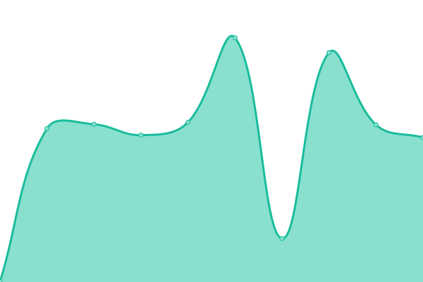
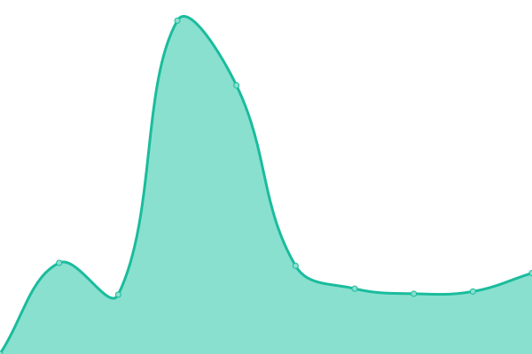

# [📈 Live Status](https://status.razvanstoica.dev/): <!--live status--> **🟩 All systems operational**

This repository contains the open-source uptime monitor and status page for [Razvan Stoica](https://status.razvanstoica.dev/), powered by [Upptime](https://github.com/upptime/upptime).

With [Upptime](https://upptime.js.org), you can get your own unlimited and free uptime monitor and status page, powered entirely by a GitHub repository. We use [Issues](https://github.com/razvanstoica89/upptime/issues) as incident reports, [Actions](https://github.com/razvanstoica89/upptime/actions) as uptime monitors, and [Pages](https://status.razvanstoica.dev/) for the status page.

<!--start: status pages-->
<!-- This summary is generated by Upptime (https://github.com/upptime/upptime) -->
<!-- Do not edit this manually, your changes will be overwritten -->
<!-- prettier-ignore -->
| URL | Status | History | Response Time | Uptime |
| --- | ------ | ------- | ------------- | ------ |
|  [RazvanStoica.dev](https://razvanstoica.dev) | 🟩 Up | [razvan-stoica-dev.yml](https://github.com/razvanstoica89/upptime/commits/HEAD/history/razvan-stoica-dev.yml) | 

 151ms
     
 | 

<a href="https://status.razvanstoica.dev/history/razvan-stoica-dev">100.00%</a>
    

|  [AquaFilters](https://aquafilters.ro) | 🟩 Up | [aqua-filters.yml](https://github.com/razvanstoica89/upptime/commits/HEAD/history/aqua-filters.yml) | 

 1392ms
     
 | 

<a href="https://status.razvanstoica.dev/history/aqua-filters">100.00%</a>
    

|  [Analize Apa](https://www.analizeapa.ro) | 🟩 Up | [analize-apa.yml](https://github.com/razvanstoica89/upptime/commits/HEAD/history/analize-apa.yml) | 

 1076ms
     
 | 

<a href="https://status.razvanstoica.dev/history/analize-apa">100.00%</a>
    

|  [Water Consulting](https://water-consulting.ro) | 🟩 Up | [water-consulting.yml](https://github.com/razvanstoica89/upptime/commits/HEAD/history/water-consulting.yml) | 

 798ms
     
 | 

<a href="https://status.razvanstoica.dev/history/water-consulting">100.00%</a>
    

|  [Dedurizare Apa](http://dedurizareapa.ro) | 🟩 Up | [dedurizare-apa.yml](https://github.com/razvanstoica89/upptime/commits/HEAD/history/dedurizare-apa.yml) | 

 818ms
     
 | 

<a href="https://status.razvanstoica.dev/history/dedurizare-apa">100.00%</a>
    

<!--end: status pages-->

[**Visit our status website →**](https://status.razvanstoica.dev/)

## 📄 License

- Powered by: [Upptime](https://github.com/upptime/upptime)
- Code: [MIT](./LICENSE) © [Razvan Stoica](https://status.razvanstoica.dev/)
- Data in the `./history` directory: [Open Database License](https://opendatacommons.org/licenses/odbl/1-0/)
